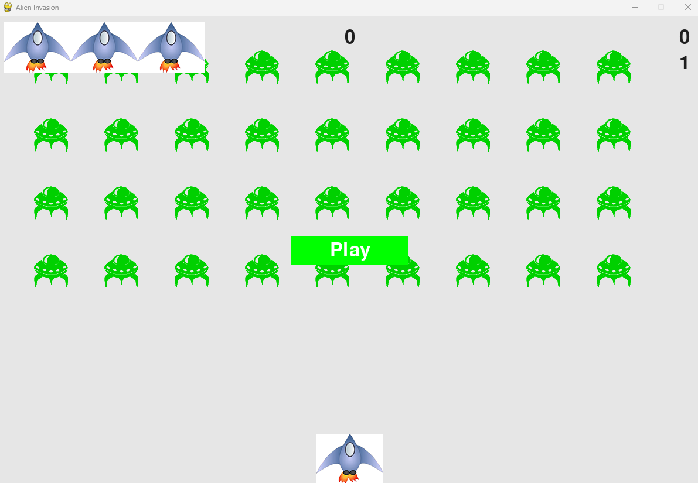

# Invasão Alienígena 🚀

Projeto desenvolvido com base no livro **"Python Crash Course"** de *Eric Matthes*.  
Um jogo estilo *Space Invaders*, criado para praticar programação em **Python** com **Pygame**.

---

## 🎮 Sobre o Jogo

O jogador controla uma nave que pode se mover horizontalmente e disparar projéteis para destruir frotas de alienígenas que descem pela tela.  
O objetivo é eliminar todos os inimigos antes que eles alcancem a parte inferior.

---

## 🖼️ Captura de Tela



> Substitua `screenshot.png` pelo nome da imagem que você colocar no repositório.

---

## 🛠️ Tecnologias Utilizadas

- [Python](https://www.python.org/) 3.x  
- [Pygame](https://www.pygame.org/)

---

## ▶️ Como Executar o Projeto

1. **Clone o repositório**:
   ```bash
   git clone https://github.com/JsnEvt/Alien_Invasion.git

2. **Acesse a pasta do projeto**:
   ```bash
   cd Alien_Invasion
   
3. **Instale as dependências**:
   ```bash
   pip install pygame

4. **Execute o jogo**:
   ```bash
   python alien_invasion.py
   
   
